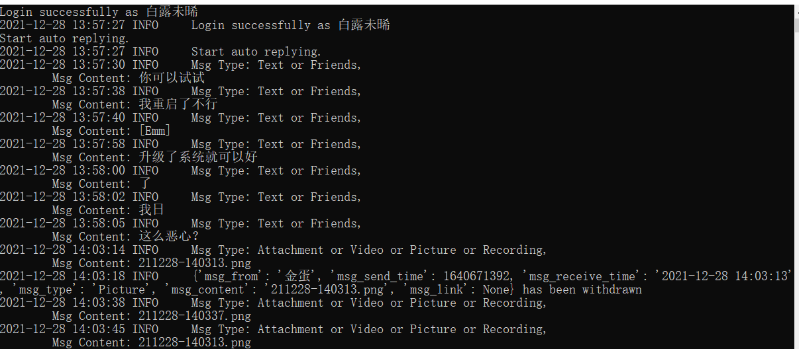

<div align="center">
  
</div>
<br />

[](https://pikachuwechat.readthedocs.io/)
[](https://pypi.org/project/pikachuwechat/)
[](https://pypi.org/project/pikachuwechat)
[](https://github.com/CharlesPikachu/pikachuwechat/blob/master/LICENSE)
[](https://pypi.org/project/pikachuwechat/)
[](https://pypi.org/project/pikachuwechat/)
[](https://github.com/CharlesPikachu/pikachuwechat/issues)
[](https://github.com/CharlesPikachu/pikachuwechat/issues)

Documents: https://pikachuwechat.readthedocs.io/zh/latest/


# PikachuWeChat
```sh
PikachuWeChat: Play WeChat with itchat-uos.
You can star this repository to keep track of the project if it's helpful for you, thank you for your support.
```


# Support List
| Function                                   | Introduction                                               | Code                                                         |  in Chinese       |
| :----:                                     | :----:                                                     | :----:                                                       |  :----:           |
| AntiWithdrawal                             | [click](https://mp.weixin.qq.com/s/R6mib62KAIIP5k6S68xqHA) | [click](./pikachuwechat/modules/core/antiwithdrawal.py)      |  微信消息防撤回   |
| AnalysisFriends                            | [click](https://mp.weixin.qq.com/s/R6mib62KAIIP5k6S68xqHA) | [click](./pikachuwechat/modules/core/analysisfriends.py)     |  微信好友分析     |
| AutoReply                                  | [click](https://mp.weixin.qq.com/s/R6mib62KAIIP5k6S68xqHA) | [click](./pikachuwechat/modules/core/autoreply.py)           |  微信自动回复     |


# Install

#### Pip install
```sh
run "pip install pikachuwechat"
```

#### Source code install
```sh
(1) Offline
Step1: git clone https://github.com/CharlesPikachu/pikachuwechat.git
Step2: cd pikachuwechat -> run "python setup.py install"
(2) Online
run "pip install git+https://github.com/CharlesPikachu/pikachuwechat.git@master"
```


# Quick Start
```python
import random
from pikachuwechat import pikachuwechat

wechat_helper = pikachuwechat.pikachuwechat()
all_supports = wechat_helper.getallsupported()
wechat_helper.execute(random.choice(list(all_supports.values())))
```


# Screenshot



# Projects in Charles_pikachu
- [Games](https://github.com/CharlesPikachu/Games): Create interesting games by pure python.
- [DecryptLogin](https://github.com/CharlesPikachu/DecryptLogin): APIs for loginning some websites by using requests.
- [Musicdl](https://github.com/CharlesPikachu/musicdl): A lightweight music downloader written by pure python.
- [Videodl](https://github.com/CharlesPikachu/videodl): A lightweight video downloader written by pure python.
- [Pytools](https://github.com/CharlesPikachu/pytools): Some useful tools written by pure python.
- [PikachuWeChat](https://github.com/CharlesPikachu/pikachuwechat): Play WeChat with itchat-uos.
- [Pydrawing](https://github.com/CharlesPikachu/pydrawing): Beautify your image or video.
- [ImageCompressor](https://github.com/CharlesPikachu/imagecompressor): Image compressors written by pure python.
- [FreeProxy](https://github.com/CharlesPikachu/freeproxy): Collecting free proxies from internet.
- [Paperdl](https://github.com/CharlesPikachu/paperdl): Search and download paper from specific websites.
- [Sciogovterminal](https://github.com/CharlesPikachu/sciogovterminal): Browse "The State Council Information Office of the People's Republic of China" in the terminal.
- [CodeFree](https://github.com/CharlesPikachu/codefree): Make no code a reality.
- [DeepLearningToys](https://github.com/CharlesPikachu/deeplearningtoys): Some deep learning toys implemented in pytorch.
- [DataAnalysis](https://github.com/CharlesPikachu/dataanalysis): Some data analysis projects in charles_pikachu.


# More
#### WeChat Official Accounts
*Charles_pikachu*  
